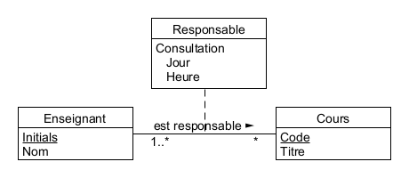
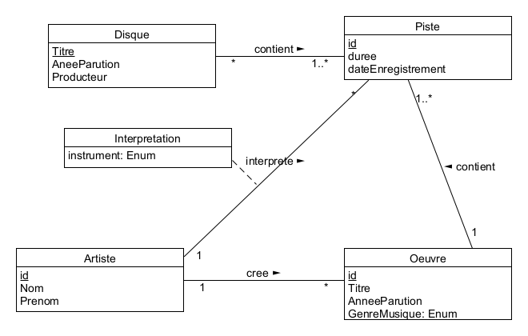
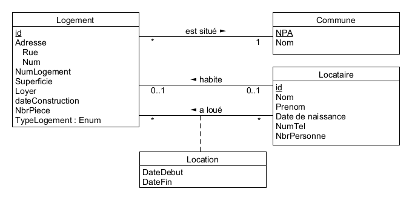
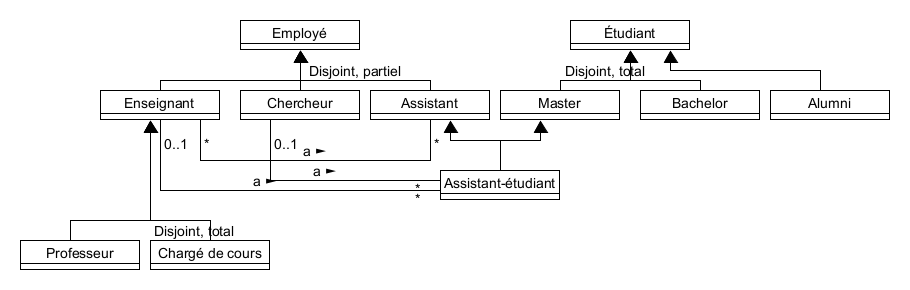
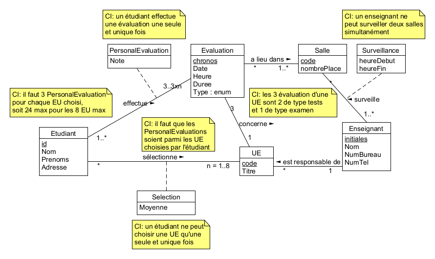

# BDR Labo 1 : Modélisation conceptuelle

Ce labo couvre les exercices 2 à 6. Ce labo est réalisé par le groupe composé de Jeremiah Steiner et Simon Guggisberg.

# 2.

## (a)

- A pas possible car cela implique qu'il y a une seule consultation par cours
- B possible mais il y a  techniquement plusieurs consultations par enseignants plutôt que par cours. mais il y a plusieurs enseignants par cours, et donc plusieurs consultations par cours.
- C pas possible car cela implique que chaque enseignant ne peut donner qu'une consultation, et donc qu'une seule par cours
- D possible car cela implique qu'il y a plusieurs consultations par cours et que l'on peut retrouver l'enseignant responsable pour un cours donné.

## (b)

- A possible car un seul enseignant peut avoir plusieurs consultations
- B possible car un seul enseignant peut être responsable de plusieurs cours, et chaque cours a juste une consultation
- C possible car pour un couple enseignant-cours, il existe une seule consultation
- D pas possible car il y a un ou plusieurs enseignants par cours et chaque cours a plusieurs consultations

## (c)

- A possible car une consultation par cours et un enseignant responsable de plusieurs cours
- B pas possible car une seule consultation par enseignant
- C possible car un enseignant est responsable de plusieurs cours et chaque cours a une consultation
- D possible car un enseignant est responsable de plusieurs cours et chaque a plusieurs consultations

## (d)

- A pas possible car il y a une seule consultation par cours
- B possible car il y a plusieurs consultations par cours
- C possible car il y a plusieurs responsables de cours mais chacun ont plusieurs consultations
- D pas possible car pour chaque couple enseignant cours il y a une seule consultation

## (e)

- A pas possible car il manque une contrainte d'intégrité pour spécifier que les enseignants qui sont responsables d'un cours sont également ceux donnant une consultation (d'ailleurs il n'existe qu'un seul responsable par cours, donc cela prête à confusion avec les plusieurs enseignants présents aux consultations)
- B possible
- C possible

## (f)
- A possible car il y a un responsable de consultation pour une paire enseignant-cours
- B possible car si il y a une consultation (note, il peut y en avoir zéro), alors il y a un seul responsable parmi le couple cours-enseignant
- C pas possible car il y a potentiellement plusieurs paires de cours-enseignant par consultation, et non pas une unique

# 3.

Sous la forme d'un attribut de type d'association "Interprétation" où Instrument est une attribut.
Il est également possible de le représenter sous la forme d'une association ternaire si la classe Instrument devenait plus complexe (tel que possédant attributs fabricant, année de fabrication, état, etc) mais nous avons décidé de garder une structure simple.

# 4.

Nous avons décidé d'ajouter un attribut de type d'association pour conserver l'historique des locations. La classe correspondante contient également la location actuelle afin de facilement pouvoir retrouver cette information.

# 5.

Nous avons décidé de représenter les alumnis comme étant des étudiants, afin de conserver des valeurs communes à celles d'un étudiant. Une autre approche aurait été d'avoir une association entre étudiant et alumni mais cette première partie d'exercice semblait se concentrer plus sur les notions de disjointure totale/partielle ainsi que de chevauchement.

Un assistant-étudiant est autant un assistant qu'un étudiant master et nous avons représenté cela via un double héritage.

# 6.

Il est impossible de représenter via un MCD les 15 UE connues puisque cela relève d'avantage de la logique, et donc des couches supérieures de l'implémentation de la base de données, que de la conception.

À noter que le nombre d'évaluations effectuées par un étudiant est égal à 3 fois le nombre d'UE que celui-ci a sélectionné. Ceci est dénoté par la variable "n".

a) la note de l'étudiant pour chaque épreuve est stockée dans un attribut de type d'association

b) Pas spécifiquement, nous pourrions enlever l'associant direct entre étudiant et UE, mais, afin de mieux représenter la situation et de traiter les informations, nous avons décidé de faire cette association directe. La manière dont nous avons implémenté le point c) nous donne également raison pour ce point.

c) le type d'association Selection permet de stocker la moyenne pour chaque couple UE-Etudiant, mais à noter que pour tout ce qui est calculs légers il est meilleure pratique de ne pas les stocker de cette manière car cela requière une mise à jour si changement d'évalutations personnelle

d) En ajoutant la classe Salle, dans laquelle se passent zéro à plusieurs évaluations, et qui sont surveillés par un à plusieurs enseignants. Le type d'association Surveillance, qui contient les heures de début et de fin de celle-ci, concerne un couple salle-surveillant et permet ainsi de suivre le temps de présence dans chaque salle, pour chaque enseignant.